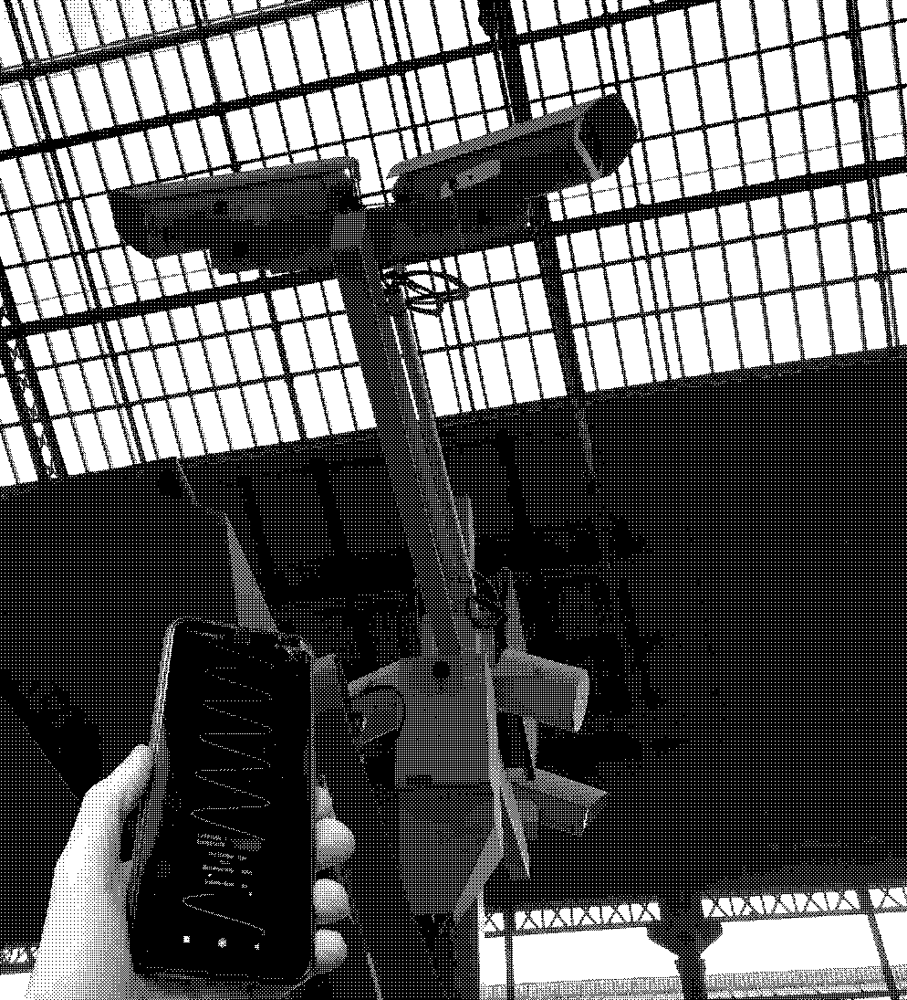

# Visiologie
## Open projects for design research

In a world where it's impossible to go outside at any moment without getting observed and recorded by various technologies around every physical or virtual corner, where mass surveillance has taken a form of tacit culture, it seems to be an absolute necessity to question our environment.

### Acoustic visioscope

Using the collaborative OpenStreetMap project and the Overpass API, specific queries can be made to retrieve targeted data within a map's perimeter. In this case, it is possible to obtain the location as well as additional information on a large portion of surveillance cameras in the surrounding area.
 
The user's distance is compared to the closest devices, and a frequency is generated accordingly. The closer the cameras, the higher the pitch of the sound. This web application allows the user to hear the surveillance devices, in this case, CCTV (closed-circuit television) cameras. It is accessible and operationable from any location in the world.
 

 

